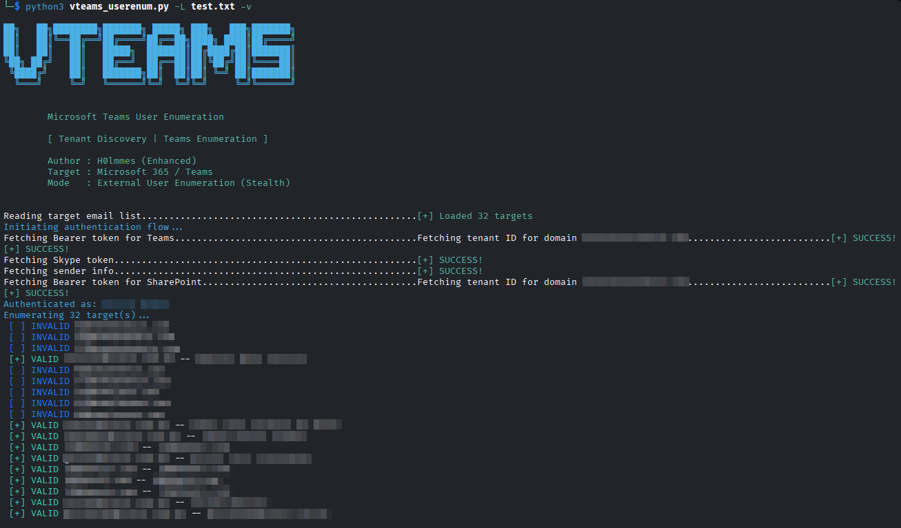

# Vteams

User enumeration via Microsoft Teams endpoints.



> ⚠️ For educational purposes and authorized testing only.

---

## 🚀 Quick Start

```bash
pip install -r requirements.txt
```

```bash
python3 vteams_userenum.py \
  -u user@domain.com \
  -p password \
  -e target@domain.com
```

```bash
cat USERS_VALID_TEAMS.txt
```

---

## ⚙️ Usage

### Single target
```bash
python3 vteams_userenum.py -u user@domain.com -p pass -e target@domain.com
```

### List
```bash
python3 vteams_userenum.py -u user@domain.com -p pass -l targets.txt
```

---

## 📦 Requirements

- Python 3.8+
- requests
- msal
- colorama

---

## 🧠 How it works

The script authenticates with a valid Microsoft 365 account and uses Teams endpoints to query external users.

Based on the API response, it is possible to distinguish between:
- valid users
- non-existent users

This works because the service returns different responses for each case.

---

## 📌 When it works

- Valid Microsoft 365 account
- Tenant with Teams enabled
- Accessible endpoints (may change over time)
- Organization allows external contact via Teams

May not work if:
- rate limiting is enforced
- API changes occur
- additional tenant protections are in place

---

## ⚠️ Legal Disclaimer

This project is intended for:

- Authorized research  
- Testing in owned environments  
- Educational purposes  

Unauthorized use may be illegal.
